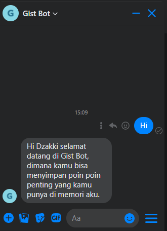

# Membuat bot untuk menyimpan poin poin penting (gist bot) dengan messanger.


### Setup aplikasi

Hal pertama yang harus kita lakukan adalah membuat setup pada aplikasi, dan pastikan nodejs sudah ter-install pada pc kita.

Langkah pertama jalankan command dibawah ini pada terminal untuk membuat `package.json`.
```
$ npm init -y
```
Kemudian update `package.json`-nya
```
// package.json
{
    /...
    "scripts": {
        "start": "node app.js"
    }
    /...
}
```

Selanjutnya kita siapkan package-package yang di butuhkan seperti [Express](#), [Axios](#), [Dotenv](#), dan [Cors](#) untuk mengembangkan aplikasi kita, dengan menjalankan command sebagai berikut.
```
$ npm install express axios dotenv cors
```

Sekarang kita siapkan struktur folder aplikasi seperti berikut ini.

```
/app 
    /node_modules
    /routes
        index.js
    /services
        dbApi.js
        graphApi.js
        receive.js
    /view
        index.html
    .env
    app.js
    package.json
    package.lock.json
``` 


### Set up webhook

Kita perlu membuat webhook, karena webhook adalah inti dari pada aplikasi kita agar bisa berkomunikasi dengan messanger sehingga aplikasi bisa menerima pesan, memproses dan mengirim pesan. Untuk membuatnya ikuti langkah langkah sebagai berikut:

#### membuat [HTTP server](#). 

Masukkan kode dibawah ini kedalam `app.js`.
```js
//app.js
require("dotenv").config()

const
    express = require('express'),
    app = express();
    PORT = process.env.PORT || 1337;


app.use(express.json());
app.use(express.urlencoded({ extended: false }));

app.listen(PORT, () => console.log('webhook is listening in port: ' + PORT));
```

#### membuat webhook 
Dengan menambahkan kode berikut pada file `/routes/index.js`.


```js
// routes/index.js
const 
    router = require("express").Router();


// Creates the endpoint for our webhook 
router.post('/webhook', (req, res) => {  
 
  let body = req.body;

  // Checks this is an event from a page subscription
  if (body.object === 'page') {

    // Iterates over each entry - there may be multiple if batched
    body.entry.forEach(function(entry) {

      // Gets the message. entry.messaging is an array, but 
      // will only ever contain one message, so we get index 0
      let webhook_event = entry.messaging[0];
      console.log(webhook_event);
    });

    // Returns a '200 OK' response to all requests
    res.status(200).send('EVENT_RECEIVED');
  } else {
    // Returns a '404 Not Found' if event is not from a page subscription
    res.sendStatus(404);
  }

});
```

Kode ini atau enpoint `/webhook` dengan method post digunakan menerima semua event-event yang dikirim-kan oleh messanger. 

Note: Pada kode ini, kita hanya membuat response dengan status kode 200 dan tidak perlu membuat response json karena tidak di butuhkan.


#### membuat verifikasi webhook 

Tambahkan kode berikut pada file `routes/index.js`.

```js
router.get('/webhook', (req, res) => {

  // Your verify token. Should be a random string.
  let VERIFY_TOKEN = "<YOUR_VERIFY_TOKEN>"
    
  // Parse the query params
  let mode = req.query['hub.mode'];
  let token = req.query['hub.verify_token'];
  let challenge = req.query['hub.challenge'];
    
  // Checks if a token and mode is in the query string of the request
  if (mode && token) {
  
    // Checks the mode and token sent is correct
    if (mode === 'subscribe' && token === VERIFY_TOKEN) {
      
      // Responds with the challenge token from the request
      console.log('WEBHOOK_VERIFIED');
      res.status(200).send(challenge);
    
    } else {
      // Responds with '403 Forbidden' if verify tokens do not match
      res.sendStatus(403);      
    }
  }
});
```

Enpoint `/webhook` dengan method `GET` gunanya untuk verifikasi webhook dari pada aplikasi kita. kita wajib membuat ini untuk memastikan webhook yang kita buat berfungsi dan milik kita. jangan lupa untuk mengubah `VERIFY_TOKEN` dengan value random string pada cuplikan kode berkut: 
```js
let VERIFY_TOKEN = "<YOUR_VERIFY_TOKEN>"
```

#### melakukan test pada webhook
 
Pertama jalankan aplikasi kita di local (localhost).
```
$ node index.js
```
Kedua kita coba untuk melakukan test pada webhook verifikasi dengan menggunakan [curl](#)

<pre>
$ curl -X GET "localhost:1337/webhook?hub.verify_token=<b>YOUR_VERIFY_TOKEN</b>&hub.challenge=CHALLENGE_ACCEPTED&hub.mode=subscribe"
</pre>

Jika test tersebut mengeluarkan tulisan `CHALLENGE_ACCEPTED` pada terminal kita, maka webhook verifikasi sudah bekerja dengan benar.

Ketiga kita coba melakukan test untuk webhook kita.
```
$ curl -H "Content-Type: application/json" -X POST "localhost:1337/webhook" -d '{"object": "page", "entry": [{"messaging": [{"message": "TEST_MESSAGE"}]}]}'
```

Jika test tersebut mengularkan tulisan `EVENT RECEIVED` pada terminal, maka webhook sudah berkeja dengan benar.

#### Deploy webhook
Sgar webhook ketika bisa digunakan untuk berkomunikasi dengan messanger, kita harus deploy pada server dengan [sertifikat SSL](#) yang valid. Kita bisa deploy aplikasi kita menggunakan heroku atau aws, tapi yang saya sarankan pake heroku saja karena mudah dan gratis.

### Hubungkan webhook dengan facebook app

Setelah kita berhasil membuat webhook, sekarang kita akan menghubungkan webhook dengan facebook app, agar webhook kita bisa digunakan untuk komunikasi dengan messanger dan sebalik-nya. 


### Persiapan

Sebelum kita mulai, ada beberapa hal yang harus kita siapkan dan pastikan kita memiliki semua yang ada dibawah ini:

- **Facebook Page**: Sebuah halaman facebook yang akan digunakan sebagai identitas messanger kita. saat orang orang mengobrol dengan aplikasi kita, maka mereka akan melihat nama dan foto dari halaman facebook kita. untuk membuat nya, kamu bisa mengunjungi link ini: [https://www.facebook.com/pages/create](https://www.facebook.com/pages/create)

- **Facebook Developer Account**: Memiliki akun Facebook Developer untuk membuat aplikasi baru, agar aplikasi kita bisa ter-integrasi dengan **Facebook App**.
untuk membuat akun Facebook Developer bisa mengunjungi [Facebook Developer](https://developers.facebook.com/) kemudian klik tombol **Get Started**.

- **Facebook App**: Memiliki facebook app untuk mengatur pengalaman messanger, termasuk akses token. untuk membuatnya, bisa kunjungi [app dashboard](https://developers.facebook.com/apps) kamu.

- **Webhook URL**: Pastikan webhook kita sudah di deploy dengan server yang ter-strifikat SSL yang valid, agar url nya sudah menjadi `HTTPS`.

### Menghubungkan webhook dengan facebook app
Sebelum kita mulai, pastikan [persiapan-persiapan](#Persiapan) di atas sudah terpenuhi.

#### Menambahkan messanger platform pada facebook app
1. Buka dashboard facebook app kamu > Klik tombol `+` di samping tulisan **PRODUCTS** pada sidebar
2. Cari produk messanger -> Klik tombol `Set Up`

Messanger platform akan ditambahkan ke produk facebook app kamu, kemudian muncul messanger `settings`.

#### Konfigurasi webhook dengan facebook appw
1. Klik tombol `settings` > Di bagian **Webhook** klik tombol `Setup Webhook`.
2. Di inputan **Callback URL** kamu bisa masukkan url webhook kamu yang sudah di deploy, contoh: `https://gist-botv2.herokuapp.com/webhook`.
3. Pada inputan **Verify Token** kamu bisa masukkan [kode verify token](#membuat-verifikasi-webhook) yang sudah kamu buat.
4. Klik tombol `Verify and Save`.

#### Menghubungkan facebook page pada facebook app
1. Klik tombol `Add or Remove Pages` -> pilih facebook page yang mau kamu gunakan cukup satu aja.
2. Di bagian **access token** disana akan ada tombol `Generate Button` setiap facebook page yang sudah ter-otorisasi. klik tombol `Generate Token` untuk mendapatkan access token, dan pastikan access token tersebut kita simpan karena akan di gunakan pada webhook kita, agar webhook bisa komunikasi dengan messanger.
3. Di bagian **Webhooks** ada daftar facebook page yang sudah ter-otorisasi > klik tombol `edit` > centang `messanges` dan `messaging_postbacks` > Save. langkah ini dilakukan agar webhook kita bisa menerima event `messanges` dan `messaging_postbacks`.

#### Test apakah webhook sudah terhubung 
Untuk mengetes apakah webhook kita sudah terhubung atau belum, kita bisa mencoba mengirim pesan pada messanger facebook page kita kemudian kita check terminal pada server kita. Jika terminal mengeluarkan event yang dikirimkan oleh messanger, maka webhook berhasil di hubungkan dengan facebook app.


### Meyimpan access token in environment variables
untuk menyimpan access token yang sudah kita generate tadi, kita bisa simpan di dalam file `.env`. Jika kita lupa access token-nya, silakan kembali ke langkah [Menghubungkan facebook page pada facebook app](#Menghubungkan-facebook-page-pada-facebook-app) pada nomer **2**

```
# Page and Application information
PAGE_ACCESS_TOKEN=<ACCESS_TOKEN>
```

### Menangani pesan salam pembuka.
ketika user mengirim pesan salam pembuka pada messanger page kita, seperti: Hello, Hi. maka messanger akan membalas pesan tersebut seperti: ` Hi <name>! selamat datang di Gist Bot, dimana kamu bisa menyimpan poin poin penting yang kamu punya di memori aku.`

<p align="center">
  
</p>

#### Membuat fungsi untuk menangani pesan yang masuk

Tambahkan kode dibawah ini pada file `/services/receive.js`

```js
class Receive {
 constructor(user, webhookEvent) {
      this.user = user;
      this.webhookEvent = webhookEvent;
  }


  async handleMessage() {
        let event = this.webhookEvent;
        let responses;
        try {
            if (event.message) { // apakah yang dikirimkan berupa message yang tidak kosong
                let message = event.message;

                if (message.text) { // apakah yang dikirimkan berupa message denga tipe text
                    responses = this.handleTextMessage(); // panggil method handleTextMessage
                }
            } 

        } catch (error) {
            console.error(error);
            responses = {
                text: `An error has occured: '${error}'. We have been notified and \
                will fix the issue shortly!`
            };
        }
  }


  handleTextMessage() {
        console.log(
            "Received text:",
            `${this.webhookEvent.message.text} for ${this.user.psid}`
        );


        let nlp = this.webhookEvent.message.nlp

        let message = this.webhookEvent.message.text.trim().toUpperCase();
        

        let response = {
            text: "pesan anda tidak bisa di baca oleh gist bot"
        }

        // apakah pesan yang dikirimkan berupa salam pembuka?
        if (  nlp 
              && nlp.traits 
              && nlp.traits['wit$greetings'] 
              && nlp.traits['wit$greetings'][0] 
              && nlp.traits['wit$greetings'][0].confidence > 0.8 
            ) {

            response = {
                text: `Hi <name> selamat datang di Gist Bot, dimana kamu bisa menyimpan poin poin penting yang kamu punya di memori aku.`
            }
        }

        return response
  }

}


module.exports = Receive

```

#### Membuat fungsi agar pesan bisa dikirim ke pengirim.

pada cuplikan kode dibawah ini 

```js
if (message.text) { // apakah yang dikirimkan berupa message denga tipe text
    responses = this.handleTextMessage(); // panggil method handleTextMessage
}
```

bahwasan-nya kita sudah menyediakan response untuk mengirimkan pesan kembali (membalas pesan). namun kita belum manangani agar pesan yang mau dikirim bisa terkirim ke pada pengirim. cara menangani hal tesebut, masukkan kode dibawah ini pada file `services/graphApi.js`

```js
const
    mPlatformUrl = `https://graph.facebook.com`,
    PAGE_ACCESS_TOKEN = process.env.PAGE_ACCESS_TOKEN,
    axios = require("axios")

    class graphApi {

    static callSendApi(requestBody) {
        // Send the HTTP request to the Messenger Platform
        console.log('Send the HTTP request to the Messenger Platform', "==============================")
        axios({
            "url": mPlatformUrl + "/v3.2/me/messages",
            "params": { "access_token": PAGE_ACCESS_TOKEN },
            "method": "POST",
            "data": requestBody
        })
            .then(() => {
                console.log('message sent!')
            })
            .catch((err) => {
                console.error("Unable to send message:" + err.toJSON());
            })
    }

}


module.exports = graphApi
```

lalu tambahkan kode dibawah ini pada file `routes/index.js`


```js
// ...
    router = require("express").Router(),
    Receive = require("../services/receive"); // import file receive


router.post('/webhook', (req, res) => {  
 
  //...


    body.entry.forEach( async function(entry) {

      let webhook_event = entry.messaging[0];
      console.log(webhook_event);

      // Get the sender PSID
      let sender_psid = +webhookEvent.sender.id;
      console.log('Sender PSID: ' + sender_psid);

      try {
            // panggil class Receive, dan masukkan psid dan webhook event sebagai data constructor
            let receiveMessage = new Receive({ psid: sender_psid }, webhookEvent);
            await receiveMessage.handleMessage() // panggil method HandleMessange

        } catch (error) {
            console.error(error)
            res.sendStatus(400);
        }
    });

  //...

});

```

#### Melakukan uji coba
setelah kita melakukan langkah langkah tersebut, alangkah baik nya kita melakukan uji coba terlebih dahulu. sebelum melakukan uji coba, kamu harus mendeploy ulang aplikasi kita.

ketika melakukan uji coba harusnya mengeluarkan hasil seperti gambar dibawah ini:
